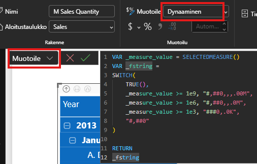
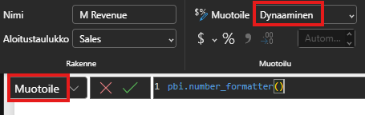
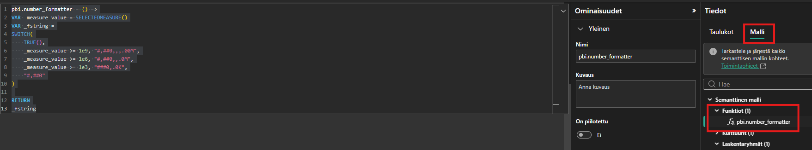
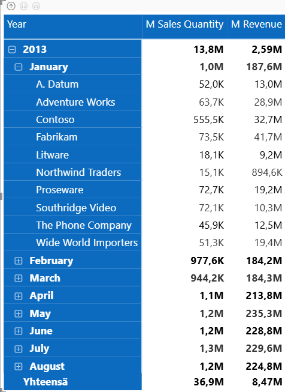

# Power BI Tricks
## Sisällysluettelo
- [Dynaaminen PBI matriisin rivien ja sarakkeiden suodatus](#dynaaminen-pbi-matriisin-rivien-ja-sarakkeiden-suodatus)
- [User Defined Functions, käyttäjän määrittelemät funktiot](#user-defined-functions-käyttäjän-määrittelemät-funktiot)
### Dynaaminen PBI matriisin rivien ja sarakkeiden suodatus
Esimerkki lopputuloksesta miten PBI matriisin rivejä ja sarakkeita voi raportin käyttäjän toimesta suodattaa dynaamisesti.

Esimerkissä oleva data on peräisin Microsoftin Contoso demo datasetista.

 

### User Defined Functions, käyttäjän määrittelemät funktiot
Esimerkkinä numeron muotoilu. Perinteinen tapa vaatii muotoilumerkkijonon tai DAX-koodia jokaiseen mittariin, johon muotoilu halutaan kohdistaa. Käyttäjän määrittelemällä funktiolla toki vaatii saman toimenpiteen, mutta ylläpito helpottuu. Muutokset voidaan tehdä pelkästään funktioon.

Muotoile-kohtaan asetetaan esim. seuraava DAX-koodi.

UDF:n kohdalla vastaava koodi olisi seuraava, mutta muotoile-kohtaan asetetaan ainoastaan funktion nimi.

Käytetyn UDF-funktion koodi.

M Sales Quantity -sarake tehty perinteisellä tavalla ja M Revenue UDF:n avulla - lopputuloksessa ei ole eroa, mutta mm. ylläpito voi helpottua UDF:n avulla reilusti.

